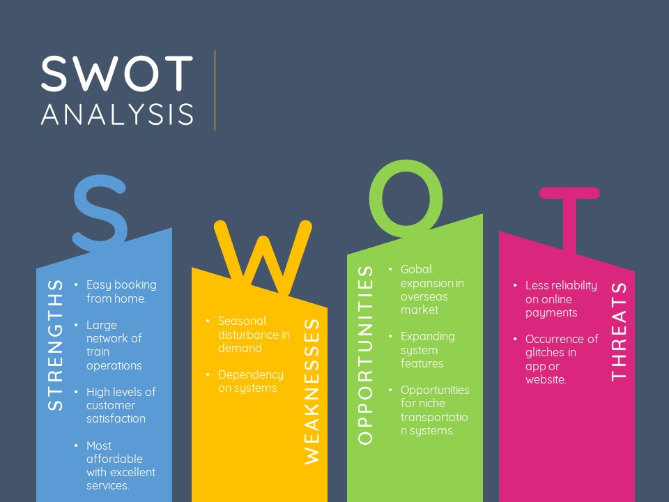

# Requirements

## Introduction
 * To make life easier the world is moving towards e-commerce. 
 
 * At first ticket booking was a tedious proces which includes two actions of which the first is taking a ride to the place where the tickets are sold and then riding to the place at the right time it's inclusive of all kind of ticket booking like theatre ticket booking, bus reservation, railway reservation etc.
 
 * A Hotel Management System is untroublesome as it will serve the admin or user to be updated about the records without any strain and it is favored much by the people involved in the business sector. As we are aware of the busy and hectic schedule of business people, this Hotel Management System turns out to be a great relief for them.

* That tediousness had came to an end when everything was under a finger touch.

* This process includes the various bookings.

## Research
* The Next Generation e-Ticketing System (NGeT) was first launched in April 2014 to handle increased capacity for ticket booking as the existing system was not ready to handle the traffic. The booking capacity was increased from 2K tickets per minute to 15K tickets per minute in 2015.

* In 1994 the debut of the first online hotel catalog was launched.To improve the likelihood of filling rooms, hotels tend to use several of the above systems. The content on many hotel reservation systems is becoming increasingly similar as more hotels sign up to all the sites. Companies thus have to either rely on specially negotiated rates with the hotels and hotel chains or trust in the influence of search engine rankings to draw in customers.

* This resulted in the percentage of internet ticketing passengers overtaking the percentage of counter ticketing passengers for the first time in 2014-15, just as the 4G revolution was hitting India.

## Cost and Features
### *Cost*
* The cost may vary depending upon the travel route.
* It may depend on the star rating of the hotel and the type of room the user wish to book.

### *Features*
* The various features/options of the system are:
#### Railway ticket Booking:
1. Reserve a ticket
2. Cancel booking
3. Display passenger details
#### Hotel Booking:
1. Book a room
2. Type of hotel/room
3. View customer record
4. Search customer record
#### Bus ticket Booking:
1. Book a ticket
2. Display details
3. Cancel a ticket
#### Food Ordering:
1. Order food
2. View food menu
3. View various Restaurant
4. Cancel food order
#### Movie Ticket Booking:
1. View current shows
2. view venue,date and time
3. book ticket
4. cancel ticket

    
## SWOT ANALYSIS

# 4W&#39;s and 1&#39;H

## Who:

The tool is a helping hand for all the citizens to reserve their railway or bus tickets,to block their rooms in a hotel or book a cinema or order a food all at one place.

## What:

Makes reservations and bookings in seconds. 
## When:

Anytime  

## Where:

Anywhere with internet connection.

## How:

Opening the website or mobile app and filling the details required.

# Detail requirements
## High Level Requirements:
|      ID        |Feature|   Description                          |Status                         |
|----------------|-------|----------------------------------------|-------------------------------|
|HR_01|Railway Ticket Booking|Booking |Implemented|
|HR_02|Railway Ticket Booking|Cancelling |Implemented|
|HR_03|Railway Ticket Booking|Viewing|Implemented|
|HR_04|Railway Ticket Booking|Tracking|Future|
|HR_05|Railway Ticket Booking|App development|Future|
|HR_06|Hotel Booking|Book a room|Implemented|
|HR_07|Hotel Booking|Type of hotel/room|Implemented|
|HR_08|Hotel Booking|View customer record|Implemented|
|HR_09|Hotel Booking|Searching|Implemented|
|HR_10|Hotel Booking|Changing the plan|Future|
|HR_11|Bus Ticket Booking|Booking |Implemented|
|HR_12|Bus Ticket Booking|Displaying |Implemented|
|HR_13|Bus Ticket Booking|Cancelling|Implemented|
|HR_14|Bus Ticket Booking|Discounts if any|Future|
|HR_15|Bus Ticket Booking|Changing mode of transport if delay|Future|
|HR_16|Food Ordering|Ordering food |Implemented|
|HR_17|Food Ordering|Displaying food menu |Implemented|
|HR_18|Food Ordering|Cancelling order|Implemented|
|HR_19|Food Ordering|Displaying Restaurants|Implemented|
|HR_20|Food Ordering|Real Time tracking of available food|Future|
|HR_21|Movie Ticket Booking|Display current movies|Implemented|
|HR_22|Movie Ticket Booking|Display venue|Future|
|HR_23|Movie Ticket Booking|Display date/time|Implemented|
|HR_24|Movie Ticket Booking|Display available seats|Implemented|
|HR_25|Movie Ticket Booking|Display available tickets according to price|Implemented|
|HR_26|Movie Ticket Booking|Transactions|Implemented|

##  Low level Requirements:
|      ID          |Description                          |  HLR_ID  |Status               |
|----------------|-------------------------------|----------|-----------------------------|
|LR_01|Name|HR_01|Implemented|
|LR_02|Age|HR_01|Implemented|
|LR_03|Starting point|HR_01|Implemented|
|LR_04|Destination|HR_01|Implemented|
|LR_05|Type of seat|HR_01|Implemented|
|LR_06|Registratio number|HR_02|Implemented|
|LR_07|Confirmation to cancel|HR_02|Implemented|
|LR_08|Name|HR_03|Implemented|
|LR_09|Registration number|HR_03|Implemented|
|LR_10|Age|HR_03|Implemented|
|LR_11|Type of seat|HR_03|Implemented|
|LR_12|Payment status|HR_03|Implemented|
|LR_13|Info about train|HR_04|Future|
|LR_14|Live route|HR_04|Future|
|LR_15|Estimation|HR_05|Future|
|LR_16|Weather|HR_05|Future|
|LR_17|Delay information|HR_05|Future|
|LR_18|Displaying the List of the hotels|HR_06|Implemented|
|LR_19|Name of the customer for booking a room|HR_06|Implemented|
|LR_20|Number of people checking in|HR_06|Implemented|
|LR_21|Date of check-in/Check-out|HR_06|Implemented|
|LR_22|Number of days of stay|HR_06|Implemented|
|LR_23|Type of room they want to book for|HR_07|Implemented|
|LR_24|Room number|HR_07|Future|
|LR_25|Customer Name for searching their details|HR_08|Implemented|
|LR_26|Entering the hotel number they selected for viewing the status|HR_08|Implemented|
|LR_27|Changing/shifting the plan|HR_10|Future|
|LR_28|Name|HR_11|Implemented|
|LR_29|Number of seats|HR_11|Implemented|
|LR_30|Bus no|HR_11|Implemented|
|LR_31|Name|HR_12|Implemented|
|LR_32|Unique ID|HR_12|Implemented|
|LR_33|Seat chosen|HR_12|Implemented|
|LR_34|Name|HR_13|Implemented|
|LR_35|Cancel confirmation|HR_13|Implemented|
|LR_36|Hotel Booking ID|HR_14|Future|
|LR_37|Number of days stay|HR_14|Future|
|LR_38|Train or flight preference|HR_15|Future|
|LR_39|Amount to be paid additional|HR_15|Future|
|LR_40|Food Name|HR_16|Implemented|
|LR_41|Quantity|HR_16|Implemented|
|LR_42|Food name|HR_17|Implemented|
|LR_43|Food price|HR_17|Implemented|
|LR_44|Food name|HR_17|Implemented|
|LR_45|Order number|HR_18|Implemented|
|LR_46|Restaurants name|HR_19|Implemented|
|LR_47|Restaurants place|HR_19|Implemented|
|LR_48|Veg / Non-Veg|HR_19|Implemented|
|LR_49|Restaurants name|HR_20|Future|
|LR_50|Food name|HR_20|Future|
|LR_51|Food quantity|HR_19|Future|
|LR_52|Displaying Available food|HR_20|Future|
|LR_53|List of movies in particular venue|HR_21|Implemented|
|LR_54|Search a movie|HR_21|Implemented|
|LR_55|Cost of the movie|HR_25|Implemented|
|LR_56|Viewing older transactions|HR_26|Implemented|
|LR_57|Payment result|HR_25|Implemented|
|LR_58|Movie genre|HR_21|Future|
|LR_59|Rating of the movie|HR_21|Future|
|LR_60|Distance of the venue|HR_22|Future|
|LR_61|Seats available for physically challenged|HR_24|Future|
|LR_62|Audio quality in a particular seat|HR_24|Future|
|LR_63|Food service in the venue|HR_22|Future|

